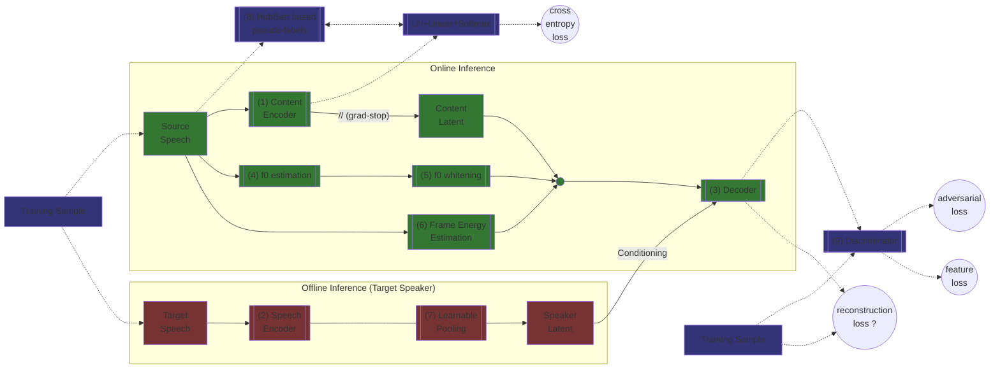

# StreamVC
An unofficial pytorch implementation of [STREAMVC: REAL-TIME LOW-LATENCY VOICE CONVERSION](https://arxiv.org/pdf/2401.03078.pdf).

## TO-Dos
### Components
- [ ] (1) Content Encoder
 - Follows [SoundStream](https://arxiv.org/pdf/2107.03312.pdf) encoder design.
 - C (scale parameter) = 64, D (embedding dimensionality) = 64.
 - No [FiLM](https://arxiv.org/pdf/1709.07871.pdf) (Feature-wise Linear Modulation) conditioning.
 - [Implementation](https://github.com/lucidrains/audiolm-pytorch/blob/main/audiolm_pytorch/soundstream.py) of SoundStream in AudioLM repo.
 - Streaming-aware convolution modules which were introduced in [KWS-Streaming](https://arxiv.org/pdf/2005.06720.pdf) and extended in [Streaming-SEANet](https://arxiv.org/pdf/2010.10677.pdf) should be used for inference. They have an official [TensorFlow/Keras implementation](https://github.com/google-research/google-research/tree/master/kws_streaming) but not in pytorch. Maybe [pytorch-tcn](https://github.com/paul-krug/pytorch-tcn/tree/main) but I don't think it's the same thing.
- [ ] (2) Speech Encoder
 - Same as (1).
 - C = 32, D = 64.
 - Per-Frame Encoding.
 - No streaming needed.
- [ ] (3) Decoder
 - Follows [SoundStream](https://arxiv.org/pdf/2107.03312.pdf) decoder design.
 - C (scale parameter) = 40, D (embedding dimensionality) = 64.
 - [FiLM](https://arxiv.org/pdf/1709.07871.pdf) (Feature-wise Linear Modulation) layers are used between residual units to condition on speaker latent from (7).
 - [Implementation](https://github.com/lucidrains/audiolm-pytorch/blob/main/audiolm_pytorch/soundstream.py) of SoundStream in AudioLM repo.
 - Streaming as in (1).
- [ ] (4) f0 estimation
 - Yin algorithm
 - [Numpy Implementation](https://github.com/patriceguyot/Yin)
 - Also [implemented in librosa](https://librosa.org/doc/main/generated/librosa.yin.html)
 - We can't use a package for this since we need internal parameters of the algorithm (he cumulative mean normalized difference value at the estimated period and the estimated unvoiced (aperiodic) signal predicate).
 - Streaming in inference.
- [ ] (5) f0 whitening
 - Normalization of the f0 envelopes based on utterance-level mean & std.
 - During streaming inference, running averages are used.
- [ ] (6) energy estimation
 - Energy of each audio frame, measured via sample variance.
 - During streaming inference, running averages are used.
- [ ] (7) Learnable Pooling
 - Global (utterance-level) context aggregator of per-frame encoding from (2).
 - Weighted average pooling where weights are derived from an attention mechanism with a single learnt query.
- [ ] (8) HuBert based pseudo labels
 - Soft labels from [HuBert](https://arxiv.org/pdf/2106.07447.pdf) based on the procedure from [Soft-VC](https://arxiv.org/pdf/2111.02392.pdf).
 - [Implementation of Soft-VC](https://github.com/bshall/soft-vc) contains a specific [implementation for this part](https://github.com/bshall/hubert) which we can probably use as is.
 - These are used to train (1) with cross-entropy loss.
- [ ] (9) Discriminator
 - based on [MelGan](https://arxiv.org/pdf/1910.06711.pdf) and [Streaming-SEANet](https://arxiv.org/pdf/2010.10677.pdf).
 - In the [Official implementation of MelGan](https://github.com/descriptinc/melgan-neurips/blob/master/mel2wav/modules.py).
 - In the [Unofficial implementation of Streaming-SEANet](https://github.com/zeroone-universe/RealTimeBWE/blob/master/MelGAN.py).

### Training
The dataset LibriTTS ([OpenSLR](https://openslr.org/60/)) is used in the paper.
It has a [dataset page](https://huggingface.co/datasets/blabble-io/libritts) in HuggingFace.
There is also LibriTTS-R ([OpenSLR](http://www.openslr.org/141/)) which is a higher quality version (cleaned LibriTTS). [HuggingFace](https://huggingface.co/datasets/blabble-io/libritts_r).

### Scripts
- [ ] `train.py` python script for training.
- [ ] `inference.py` python script for inference on a single source & target combo.

