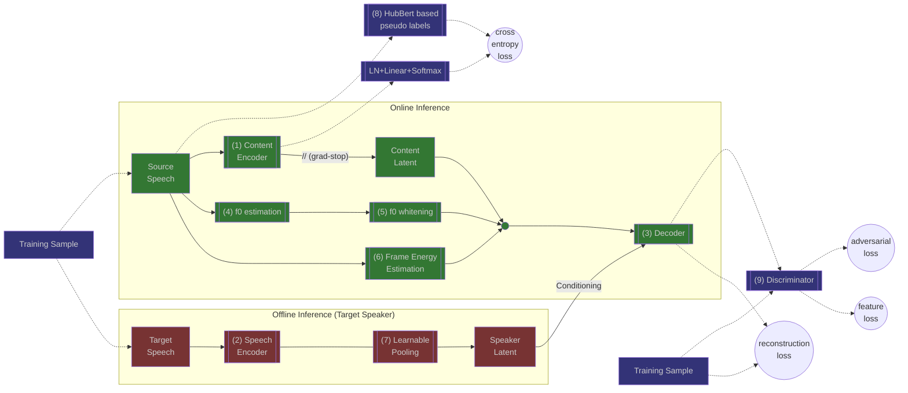

# StreamVC
An unofficial pytorch implementation of [STREAMVC: REAL-TIME LOW-LATENCY VOICE CONVERSION](https://arxiv.org/pdf/2401.03078.pdf).
It was created for learning purposes, it isn't feature complete, and it doesn't replicate the results from the paper.

The streaming infernce isn't fully implemented.



## Example Usage
### Training
#### Requirements
To install the requirements for training run:
```bash
pip install -r requirements-training.txt
```
#### Running the training script
`train.py` is the python script for training, it uses [🤗 Accelerate](https://huggingface.co/docs/accelerate).
To cofigure Accelerate to your enviroenment use [`accelerator config`](https://huggingface.co/docs/accelerate/package_reference/cli#accelerate-config).

To launch the script, run:
```bash
accelerate launch [ACCELERATE-OPTIONS] train.py [TRAINING-OPTIONS]
```
To see the available training options, run: 

```
python train.py --help
```
### Inference
#### Requirements
To install the requirements for inference run:
```bash
pip install -r requirements-inference.txt
```
#### Running the script
 `inference.py` is the python script for inference on a single source & target combo.


To launch the script, run:
```bash
python inference.py [INFERENCE-OPTIONS] -s <source_speech> -t <target_speech>
-o <output_file>
```
To see the available inference options, run: 

```
python inference.py --help
```

## Acknowledgements
This project was made possible by the following open source projects:

 - For the encoder-decoder architecture (based on SoundStream) we based our code on [AudioLM's official implementation](https://github.com/lucidrains/audiolm-pytorch).
 - For the multi-scale discriminator and the discriminator losses we based our code on [MelGan's official implementation](https://github.com/descriptinc/melgan-neurips).
 -  For the HuBert discrete units computation we used the HuBert + KMeans implementation from [SoftVC's official implementation](https://github.com/bshall/soft-vc).
 - For the Yin algorithm we based our implementation on the [torch-yin package](https://github.com/brentspell/torch-yin).